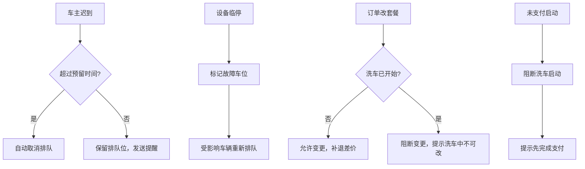

## 1. 产品概述

自助洗车排队工作台——面向门店运营的实时排队与车位管理系统，覆盖车主排队、店员调度、运维排障、运营决策四类角色场景。系统基于车位占用、设备故障、超时规则和未支付订单进行智能队列准入判断，确保洗车业务连续运转。

- 解决传统洗车排队无序、车位信息不透明、故障/超时处理滞后的问题
- 目标用户：洗车店车主、店员、运维人员、运营经理，提供一站式实时工作台

## 2. 核心功能

### 2.1 用户角色

| 角色 | 注册方式 | 核心权限 |
|------|----------|----------|
| 车主 | 手机号快捷注册 | 排队取号、查看队列状态、选择套餐与支付、接收超时提醒 |
| 店员 | 管理员分配账号 | 排队管理、标记设备故障、手工释放车位、处理异常订单、生成操作记录 |
| 运维人员 | 管理员分配账号 | 设备状态监控、故障上报与修复确认、维护计划管理 |
| 运营经理 | 管理员分配账号 | 收入报表、超时占用分析、故障损失统计、异常取消审计 |

### 2.2 功能模块

1. **排队工作台（首页）**：实时车位状态看板、当前队列列表、快速操作入口
2. **车主排队页**：选择车型与服务套餐、选择预计到店时间、选择支付方式、队列准入判断结果展示
3. **店员调度台**：车位占用/空闲切换、设备故障标记、手工释放车位、超时处理、操作日志
4. **运营数据看板**：收入统计、超时占用率、故障损失金额、异常取消率、趋势图表
5. **订单管理页**：订单列表、订单详情、套餐变更、取消与退款、支付状态追踪

### 2.3 页面详情

| 页面名称 | 模块名称 | 功能描述 |
|----------|----------|----------|
| 排队工作台 | 车位状态看板 | 实时展示每个洗车车位：空闲/占用/故障/超时，颜色区分状态 |
| 排队工作台 | 队列列表 | 当前等待队列，显示序号、车型、套餐、预计到店、等待时长 |
| 排队工作台 | 快速操作栏 | 一键取号、扫码入队、紧急释放车位等快捷按钮 |
| 车主排队页 | 车型选择 | SUV/轿车/MPV/微面等，不同车型对应不同洗车时长与价格 |
| 车主排队页 | 服务套餐选择 | 标准洗/精洗/内饰清洁+外观/全套等，套餐关联价格与时长 |
| 车主排队页 | 预计到店时间 | 选择10/20/30/45/60分钟后到店，系统校验是否可排队 |
| 车主排队页 | 支付方式选择 | 线上支付/到店支付/会员卡扣费，未支付阻断启动洗车 |
| 车主排队页 | 准入判断结果 | 显示能否进入队列及原因（车位满/设备故障/有未支付订单等） |
| 店员调度台 | 车位操作面板 | 每个车位可标记：占用→空闲释放、空闲→占用分配、标记故障 |
| 店员调度台 | 设备故障标记 | 选择故障设备、故障类型、严重程度，自动调整队列 |
| 店员调度台 | 手工释放车位 | 强制释放超时车位，影响后续排队顺序，生成操作记录 |
| 店员调度台 | 操作日志 | 记录所有店员操作：时间、操作人、操作内容、影响范围 |
| 运营数据看板 | 收入统计 | 今日/本周/本月收入，按套餐/支付方式分类统计 |
| 运营数据看板 | 超时占用分析 | 超时次数、超时时长分布、超时加价收入、频繁超时车牌 |
| 运营数据看板 | 故障损失统计 | 故障次数、故障时长、估算损失金额、故障设备排名 |
| 运营数据看板 | 异常取消审计 | 取消次数、取消原因分布、退款金额、异常取消预警 |
| 订单管理页 | 订单列表 | 按状态筛选：排队中/洗车中/已完成/已取消/超时加价 |
| 订单管理页 | 订单详情 | 完整订单信息、支付记录、超时记录、套餐变更记录 |
| 订单管理页 | 套餐变更 | 更改服务套餐，补差价或退差价，生成变更记录 |
| 订单管理页 | 取消退款 | 取消订单并按规则退款，超时已启动不可退 |

## 3. 核心流程

### 3.1 车主排队流程

车主打开小程序/页面 → 选择车型 → 选择服务套餐 → 选择预计到店时间 → 选择支付方式 → 系统执行准入判断（检查车位可用性、设备故障状态、是否有未支付订单、超时规则约束） → 准入通过则加入队列并分配排队序号 → 准入不通过则展示原因并给出建议（如建议稍后再试或选择其他套餐）

### 3.2 洗车执行流程

车位空闲 → 系统叫号下一排队车辆 → 车主到店确认 → 支付校验（未支付则阻断启动） → 车位标记占用 → 开始洗车 → 计时开始 → 洗车完成 → 车位释放 → 下一辆

### 3.3 超时处理流程

洗车超时 → 系统按规则加价 → 通知车主超时加价 → 车主确认或取消 → 超时达上限则强制结束 → 店员可手工释放车位

### 3.4 设备故障处理流程

店员/运维发现故障 → 标记故障设备 → 系统自动将该车位从可用池移除 → 队列中分配到该车位的车辆重新排队 → 故障修复 → 运维确认恢复 → 车位重新加入可用池

### 3.5 异常处理流程

## 4. 用户界面设计

### 4.1 设计风格

- 主色调：深蓝 #0F172A（运营感、专业感）+ 亮青 #06D6A0（状态高亮）+ 警示橙 #FF6B35（超时/故障）
- 按钮风格：圆角 8px，轻微阴影，悬停放大 1.02 倍
- 字体：数字使用等宽字体 JetBrains Mono，标题使用 Noto Sans SC Bold，正文使用 Noto Sans SC Regular
- 布局风格：左侧导航栏 + 右侧内容区，卡片式布局，数据看板使用网格卡片
- 图标风格：线性图标（Lucide），统一 20px 尺寸

### 4.2 页面设计概览

| 页面名称 | 模块名称 | UI 元素 |
|----------|----------|---------|
| 排队工作台 | 车位状态看板 | 网格布局车位卡片，空闲(绿)/占用(蓝)/故障(橙)/超时(红) 四色状态，实时刷新动画 |
| 排队工作台 | 队列列表 | 表格布局，行悬停高亮，等待时长实时倒计时，序号徽章 |
| 车主排队页 | 车型选择 | 横向图标卡片选择器，选中态边框高亮 + 缩放动画 |
| 车主排队页 | 套餐选择 | 纵向价格卡片，推荐套餐星标，价格大字号展示 |
| 车主排队页 | 准入结果 | 通过(绿勾动画)/不通过(红叉 + 原因卡片) |
| 店员调度台 | 车位操作面板 | 大卡片布局，每车位一个操作卡，状态切换有过渡动画 |
| 店员调度台 | 操作日志 | 时间轴样式，按时间倒序，操作类型标签色区分 |
| 运营数据看板 | 收入统计 | 数字翻牌动画，环形占比图，趋势折线图 |
| 运营数据看板 | 超时/故障/取消 | 统计卡片 + 排行榜列表 + 柱状图 |

### 4.3 响应式设计

- 桌面优先设计，支持 1280px+ 宽屏展示
- 中等屏幕(768-1280px)：左侧导航收缩为图标模式
- 移动端(＜768px)：底部标签栏导航，卡片单列堆叠，触控优化按钮尺寸
- 车主端特别优化移动端体验

### 4.4 动效设计

- 页面加载：卡片依次从下方淡入，stagger 100ms
- 状态变更：颜色渐变过渡 300ms，车位状态切换有缩放弹跳
- 数据刷新：数字变化使用翻牌动画
- 超时提醒：脉冲红色边框动画
- 队列更新：新增行滑入动画，移除行滑出动画
