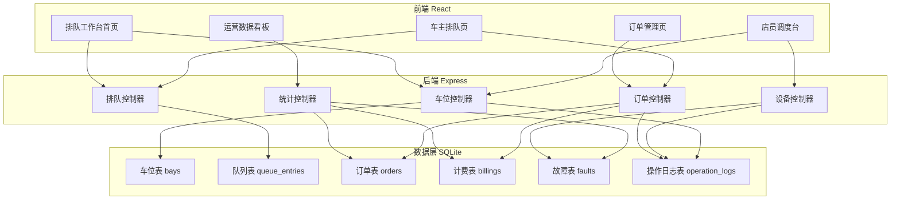
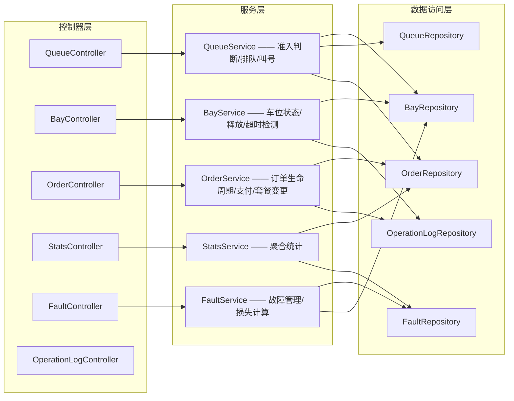
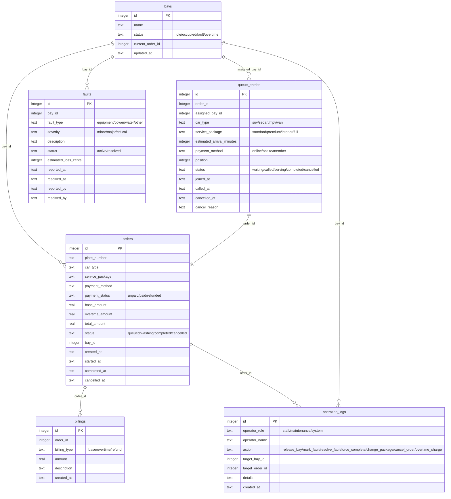

## 1. 架构设计



## 2. 技术说明

- 前端：React@18 + TypeScript + Tailwind CSS@3 + Vite + Zustand（状态管理）
- 初始化工具：vite-init
- 后端：Express@4 + TypeScript（ESM 模式）
- 数据库：SQLite（本地持久化，容器启动即可用）
- 图表：Recharts
- 图标：lucide-react

## 3. 路由定义

| 路由 | 用途 |
|------|------|
| / | 排队工作台首页——车位看板 + 队列列表 |
| /queue | 车主排队页——车型/套餐/到店时间/支付选择 |
| /staff | 店员调度台——车位操作/故障标记/操作日志 |
| /operations | 运营数据看板——收入/超时/故障/取消统计 |
| /orders | 订单管理页——订单列表/详情/变更/取消 |

## 4. API 定义

### 4.1 排队相关

```
POST   /api/queue/check-eligibility  —— 准入判断（车位/故障/超时/未支付订单）
POST   /api/queue/join               —— 加入队列
DELETE /api/queue/:id                 —— 退出队列（迟到自动取消/手动取消）
GET    /api/queue                     —— 查询当前队列
POST   /api/queue/call-next           —— 叫号下一辆
```

### 4.2 车位相关

```
GET    /api/bays                     —— 获取所有车位状态
PATCH  /api/bays/:id/status          —— 更新车位状态（空闲/占用/故障/超时）
POST   /api/bays/:id/release         —— 手工释放车位（店员操作）
POST   /api/bays/:id/force-complete  —— 强制完成洗车（超时处理）
```

### 4.3 订单相关

```
GET    /api/orders                   —— 订单列表（支持状态筛选）
GET    /api/orders/:id               —— 订单详情
POST   /api/orders                   —— 创建订单（排队成功后自动创建）
PATCH  /api/orders/:id/package       —— 变更套餐
POST   /api/orders/:id/cancel        —— 取消订单（含退款逻辑）
PATCH  /api/orders/:id/pay           —— 支付/确认支付
POST   /api/orders/:id/start-wash   —— 启动洗车（含未支付阻断）
POST   /api/orders/:id/overtime-charge —— 超时加价
```

### 4.4 设备/故障相关

```
GET    /api/faults                   —— 故障列表
POST   /api/faults                   —— 上报故障（标记设备故障）
PATCH  /api/faults/:id/resolve       —— 修复确认（车位恢复可用）
GET    /api/faults/stats             —— 故障统计
```

### 4.5 统计相关

```
GET    /api/stats/revenue             —— 收入统计
GET    /api/stats/overtime            —— 超时占用统计
GET    /api/stats/fault-loss           —— 故障损失统计
GET    /api/stats/cancellation         —— 异常取消统计
GET    /api/stats/overview             —— 运营概览
```

### 4.6 操作日志

```
GET    /api/operation-logs            —— 操作日志列表
POST   /api/operation-logs           —— 记录操作日志（内部调用）
```

## 5. 服务端架构图



## 6. 数据模型

### 6.1 数据模型定义



### 6.2 数据定义语言

```sql
CREATE TABLE bays (
    id INTEGER PRIMARY KEY AUTOINCREMENT,
    name TEXT NOT NULL,
    status TEXT NOT NULL DEFAULT 'idle' CHECK(status IN ('idle','occupied','fault','overtime')),
    current_order_id INTEGER,
    updated_at TEXT NOT NULL DEFAULT (datetime('now'))
);

CREATE TABLE queue_entries (
    id INTEGER PRIMARY KEY AUTOINCREMENT,
    order_id INTEGER NOT NULL,
    assigned_bay_id INTEGER,
    car_type TEXT NOT NULL CHECK(car_type IN ('suv','sedan','mpv','van')),
    service_package TEXT NOT NULL CHECK(service_package IN ('standard','premium','interior','full')),
    estimated_arrival_minutes INTEGER NOT NULL DEFAULT 10,
    payment_method TEXT NOT NULL CHECK(payment_method IN ('online','onsite','member')),
    position INTEGER NOT NULL,
    status TEXT NOT NULL DEFAULT 'waiting' CHECK(status IN ('waiting','called','serving','completed','cancelled')),
    joined_at TEXT NOT NULL DEFAULT (datetime('now')),
    called_at TEXT,
    cancelled_at TEXT,
    cancel_reason TEXT,
    FOREIGN KEY (order_id) REFERENCES orders(id),
    FOREIGN KEY (assigned_bay_id) REFERENCES bays(id)
);

CREATE TABLE orders (
    id INTEGER PRIMARY KEY AUTOINCREMENT,
    plate_number TEXT NOT NULL,
    car_type TEXT NOT NULL,
    service_package TEXT NOT NULL,
    payment_method TEXT NOT NULL,
    payment_status TEXT NOT NULL DEFAULT 'unpaid' CHECK(payment_status IN ('unpaid','paid','refunded')),
    base_amount REAL NOT NULL DEFAULT 0,
    overtime_amount REAL NOT NULL DEFAULT 0,
    total_amount REAL NOT NULL DEFAULT 0,
    status TEXT NOT NULL DEFAULT 'queued' CHECK(status IN ('queued','washing','completed','cancelled')),
    bay_id INTEGER,
    created_at TEXT NOT NULL DEFAULT (datetime('now')),
    started_at TEXT,
    completed_at TEXT,
    cancelled_at TEXT,
    FOREIGN KEY (bay_id) REFERENCES bays(id)
);

CREATE TABLE billings (
    id INTEGER PRIMARY KEY AUTOINCREMENT,
    order_id INTEGER NOT NULL,
    billing_type TEXT NOT NULL CHECK(billing_type IN ('base','overtime','refund')),
    amount REAL NOT NULL,
    description TEXT,
    created_at TEXT NOT NULL DEFAULT (datetime('now')),
    FOREIGN KEY (order_id) REFERENCES orders(id)
);

CREATE TABLE faults (
    id INTEGER PRIMARY KEY AUTOINCREMENT,
    bay_id INTEGER NOT NULL,
    fault_type TEXT NOT NULL CHECK(fault_type IN ('equipment','power','water','other')),
    severity TEXT NOT NULL CHECK(severity IN ('minor','major','critical')),
    description TEXT,
    status TEXT NOT NULL DEFAULT 'active' CHECK(status IN ('active','resolved')),
    estimated_loss_cents INTEGER NOT NULL DEFAULT 0,
    reported_at TEXT NOT NULL DEFAULT (datetime('now')),
    resolved_at TEXT,
    reported_by TEXT NOT NULL,
    resolved_by TEXT,
    FOREIGN KEY (bay_id) REFERENCES bays(id)
);

CREATE TABLE operation_logs (
    id INTEGER PRIMARY KEY AUTOINCREMENT,
    operator_role TEXT NOT NULL CHECK(operator_role IN ('staff','maintenance','system')),
    operator_name TEXT NOT NULL,
    action TEXT NOT NULL CHECK(action IN ('release_bay','mark_fault','resolve_fault','force_complete','change_package','cancel_order','overtime_charge','start_wash','call_next','join_queue')),
    target_bay_id INTEGER,
    target_order_id INTEGER,
    details TEXT,
    created_at TEXT NOT NULL DEFAULT (datetime('now')),
    FOREIGN KEY (target_bay_id) REFERENCES bays(id),
    FOREIGN KEY (target_order_id) REFERENCES orders(id)
);

-- 初始数据：创建4个洗车车位
INSERT INTO bays (name, status) VALUES
    ('1号车位', 'idle'),
    ('2号车位', 'idle'),
    ('3号车位', 'idle'),
    ('4号车位', 'idle');

-- 套餐定价配置（通过代码常量管理）
-- standard: 25元, premium: 45元, interior: 55元, full: 78元
-- 车型加价：suv +10元, mpv +15元, van +20元
-- 超时规则：超出套餐时长后每5分钟加收5元，上限30元
-- 迟到规则：超过预计到店时间10分钟自动取消排队
